```{r setup, include=FALSE}
if(!(require(knitr))) 
require(knitr)
knitr::opts_chunk$set(echo = TRUE, message = FALSE, warning = FALSE, 
                      comment = NA, prompt = TRUE, tidy = FALSE, 
                      fig_caption = TRUE, fig.align="center",
                      cache=FALSE)
if(!(require(BiocManager))) 
  install.packages("BiocManager")
if(!(require(Biobase))) 
  BiocManager::install("Biobase")
if(!(require(kableExtra))) 
  BiocManager::install("kableExtra")
if(!(require(oligo))) 
  BiocManager::install("oligo")
if(!(require(pvca))) 
  BiocManager::install("pvca")
if(!(require(ggrepel))) 
  install.packages("ggrepel")
if(!(require(colorspace))) 
  install.packages("colorspace")
if(!(require(gplots))) 
  install.packages("gplots")
if(!(require(ggupset))) 
  install.packages("ggupset")
if(!(require(magrittr))) 
  install.packages("magrittr")
if(!(require(clusterProfiler))) 
  BiocManager::install("clusterProfiler")
if(!(require(DOSE))) 
  BiocManager::install("DOSE")
if(!(require(RColorBrewer))) 
  install.packages("RColorBrewer")
if(!(require(ggplot2))) 
  install.packages("ggplot2")
if(!(require(hgu133plus2.db))) 
BiocManager::install("hgu133plus2.db")
if(!(require(arrayQualityMetrics))) 
  BiocManager::install("arrayQualityMetrics")
if(!(require(limma))) 
  BiocManager::install("limma")
if(!(require(genefilter))) 
  BiocManager::install("genefilter")
if(!(require(annotate))) 
  BiocManager::install("annotate")
if(!(require(enrichplot))) 
  BiocManager::install("enrichplot")
```

***

*The last versión of the current document, with all the relevant files and code, and all data associated with the report can be found in:*    

https://github.com/piosierra/ADO-PEC1  

*The original study can be found in:*      

https://www.ncbi.nlm.nih.gov/pubmed/20090954  

***

# Abstract

We reproduce the microarray analysis of the study *Dynamic Innate Immune Responses of Human Bronchial Epithelial Cells to Severe Acute Respiratory Syndrome-Associated Coronavirus Infection*  **[@yoshikawa_dynamic_2010]**. They employed a cDNA microarray to analyze the patterns of the global gene expression of 2B4 cells in response to SARS-CoV, as the first step to explore the likely antiviral signaling pathway/s.

# Objectives
To perform a differential gene expression (DGE) analysis on SARS-CoV infected 2B4 cells at 12-, 24-, and 48-hrs post infection. The study aims to identify the complex epithelial signaling to SARS-CoV that is crucial for paving the way to better understand SARS pathogenesis.

As mentioned on the study, even if the analysis was performed simultaneosly for the Sars-CoV and DOHV infected cells, for the study they did only use the files belonging to the control and Sars-Cov infected cells. The analysis with the DOHV data belongs to a different study and it is not included on that one.

# Materials and Methods

## Materials 
We use the published data for the experiment that can be found on GEO GSE17400:  
https://www.ncbi.nlm.nih.gov/geo/query/acc.cgi?acc=GSE17400

We will reproduce the whole experiment, again, even if the DOHV data was not used in the mentioned study.
To characterize the dynamic, spatial, and temporal changes of the gene expression induced by SARS-CoV, confluent 2B4 cells grown in T-75 flasks were infected with SARS-CoV (MOI=0.1) or remained uninfected (as control) for 12, 24, and 48hrs. Because 2B4 cells were also permissive to the productive infection of Dhori virus (DHOV), a member of the Orthomyxoviridae family within the Thogotovirus genus, resulting in robust responses of IFNs and other pro-inflammatory mediators, they also established parallel cultures of DHOV-infected 2B4 cells (MOI=0.1) for the comparative analysis of global gene expression elicited by SARS-CoV- versus DHOV-infected 2B4 cells. To meet the minimal number required for application of statistical algorithms, we performed the study in triplicate at each time point for mock-, SARS-CoV-, and DHOV-infected cultures, yielding a total of 27 arrays.
Mock-infected cells were compared to cells infected with SARS-CoV or DHOV at each time point. 

The microarrays used were Affymetrix Human Genome U133 Plus 2.0 Array annotation data (chip hgu133plus2)   
http://bioconductor.org/packages/release/data/annotation/html/hgu133plus2.db.html
https://www.affymetrix.com/support/technical/datasheets/human_datasheet.pdf

We used R and Bioconductor to perform the analysis. The full list of packages employed can be found on the Apnedix.  

## Methods

On the working directory it is asumed we have the following folders to work with:
- data: where the CEL files are downloaded  
- results: where the results data files will be stored  
- figures: where the figures produced are stored  

We describe now the workflow followed:  

**a) Identify the groups and match groups to files.**  

There are 27 arrays were analyzed as 9 separate groups (mock-, SARS-CoV-infected, and DHOV-infected cells at 12, 24, and 48 hrs).


```{r eval = FALSE, include=FALSE}

url <- "https://www.ncbi.nlm.nih.gov/geo/download/?acc=GSE17400&format=file"
utils::download.file(url, destfile = "data.tar", mode="wb") 
utils::untar("data.tar", exdir = "data")

```


```{r echo=FALSE}
targets <- read.csv2("targets.csv", header = TRUE, sep = ";") 
kable_styling(knitr::kable(targets, booktabs = TRUE,
                            caption = 'Content of the targe file used for the analysis'),font_size = 10)
```
```{r include =FALSE}
library(oligo)
celFiles <- list.celfiles("./data", full.names = TRUE, listGzipped=TRUE)
library(Biobase)
my.targets <-read.AnnotatedDataFrame(file.path(".","targets.csv"), 
                                     header = TRUE, row.names = 1, 
                                     sep=";") 
rawData <- read.celfiles(celFiles, phenoData = my.targets)
```
**b) Quality control of the raw data.**  

We perform a quality control of the data with the package arrayQualityMetrics. The results can be found on the apendix.  
There are two marks on two of the samples (Fig.1), but we decided to use all the samples as none of them had issues with the three metrics, and they were used on the reference study. A deeper analysis might be performed to clarify the correctness of this data.

```{r QCRaw, message=FALSE, warning=FALSE, eval=FALSE, include=FALSE}
require(arrayQualityMetrics)
arrayQualityMetrics(rawData, outdir = file.path("./results", "QCDir.Raw"), force=TRUE)
```
We also performed a Principal Components Analysis and boxplot proyection that did not show any special problems with the data. (Fig. 14)

```{r, include=FALSE}
plotPCA3 <- function (datos, labels, factor, title, scale,colores, size = 1.5, glineas = 0.25) {
  data <- prcomp(t(datos),scale=scale)
  # plot adjustments
  dataDf <- data.frame(data$x)
  Group <- factor
  loads <- round(data$sdev^2/sum(data$sdev^2)*100,1)
  # main plot
  p1 <- ggplot(dataDf,aes(x=PC1, y=PC2)) +
    theme_classic() +
    geom_hline(yintercept = 0, color = "gray70") +
    geom_vline(xintercept = 0, color = "gray70") +
    geom_point(aes(color = Group), alpha = 0.55, size = 3) +
    coord_cartesian(xlim = c(min(data$x[,1])-5,max(data$x[,1])+5)) +
    scale_fill_discrete(name = "Group")
  # avoiding labels superposition
  p1 + geom_text_repel(aes(y = PC2 + 0.25, label = labels),segment.size = 0.25, size = size) + 
    labs(x = c(paste("PC1",loads[1],"%")),y=c(paste("PC2",loads[2],"%"))) +  
    ggtitle(paste("Principal Component Analysis for: ",title,sep=" "))+ 
    theme(plot.title = element_text(hjust = 0.5)) +
    scale_color_manual(values=colores)
  }
colorsq <- brewer.pal(12, "Dark2")
colorss <- brewer.pal(12, "YlOrRd")
colorsd <- brewer.pal(12, "Spectral")
png("figures/PCAraw.png", width = 680, height = 680)
print(plotPCA3(exprs(rawData), labels = targets$ShortName, factor = targets$Group, 
         title="Raw data", scale = FALSE, size = 3, 
         colores = c(rep(colorsq[1], 3),
                     rep(colorsq[2], 3),
                     rep(colorsq[3], 3))))
dev.off()
```


To analize the intensity distribution on the arrays we used boxplots for each of the datasets. (Fig. 16)   


```{r include=FALSE}
png("figures/boxplotraw.png", width = 680, height = 680)
print(boxplot(rawData, cex.axis=0.5, las=2,  which="all", 
         col = c(rep(colorsd[1], 3), 
                 rep(colorsd[2], 3), 
                 rep(colorsd[3], 3),
                 rep(colorsd[4], 3),
                 rep(colorsd[5], 3),
                 rep(colorsd[6], 3),
                 rep(colorsd[7], 3),
                 rep(colorsd[8], 3),
                 rep(colorsd[9], 3)),
         main="Distribution of raw intensity values"))
dev.off()


```


**c) Data Normalization.**   

We use the RMA (Robust Multichip Analysis) to perform background correction, normalization and summarize the data.  
```{r include=FALSE}
eset_rma <- rma(rawData)
```

**d) Quality control of the normalized data.**  

We repeat the same analysis with the normalized data. As expected now the first component accounts for less total variability, the percentage of explained variability has decreased with respect to PCA performed on raw data. Similarly the boxplots appear with similar aspect. Which suggest the distribution of the normalized intensities is the same in all samples.


```{r eval=FALSE, include = FALSE}
arrayQualityMetrics(eset_rma, outdir = file.path("./results", "QCDir.Norm"), force=TRUE)
```
```{r include=FALSE}
png("figures/PCAnorm.png", width = 680, height = 680)
print(plotPCA3(exprs(eset_rma), labels = targets$ShortName, factor = targets$Group, 
         title="Normalized data", scale = FALSE, size = 3, 
         colores = c(rep(colorsq[1], 3),
                     rep(colorsq[2], 3),
                     rep(colorsq[3], 3))))
dev.off()
```
```{r include=FALSE}
png("figures/boxplotnorm.png", width = 680, height = 680)
print(boxplot(eset_rma, cex.axis=0.5, las=2,  which="all", 
         col = c(rep(colorsd[1], 3), 
                 rep(colorsd[2], 3), 
                 rep(colorsd[3], 3),
                 rep(colorsd[4], 3),
                 rep(colorsd[5], 3),
                 rep(colorsd[6], 3),
                 rep(colorsd[7], 3),
                 rep(colorsd[8], 3),
                 rep(colorsd[9], 3)),
         main="Distribution of raw intensity values"))
dev.off()

```

**e) Identify Differentially expresed genes.**   

We want to identify the genes that have been differentialy expressed. First we show the standard deviations of all genes sorted from smallest to biggest values. The plot shows that the most variable genes are those with a standard deviation above 90-95% of all standard deviations.

```{r echo=FALSE}
sds <- apply (exprs(eset_rma), 1, sd)
sdsO<- sort(sds)
plot(1:length(sdsO), sdsO, main="Distribution of variability for all genes",
     sub="Vertical lines represent 90% and 95% percentiles",
     xlab="Gene index (from least to most variable)", ylab="Standard deviation")
abline(v=length(sds)*c(0.9,0.95))
```

And we use the function nsFilter from the bioconductor package genefilter to remove genes based on a variability threshold. As we have the annotation package be use it also to remove probesets which do not have a gene identifier associated.   

After that we save the normalized and filtered data on the results folder.


```{r include=FALSE} 
annotation(eset_rma) <- "hgu133plus2.db"
filtered <- nsFilter(eset_rma, 
                     require.entrez = TRUE, remove.dupEntrez = TRUE,
                     var.filter=TRUE, var.func=IQR, var.cutoff=0.75, 
                     filterByQuantile=TRUE, feature.exclude = "^AFFX")
print(filtered$filter.log)
eset_filtered <-filtered$eset
write.csv(exprs(eset_rma), file="./results/normalized.Data.csv")
write.csv(exprs(eset_filtered), file="./results/normalized.Filtered.Data.csv")
```

**f) Definition of the experimental setup.**  

We use the Linear Models for Microarrays method, as implemented in the limma package [@law_rna-seq_2018] is used to select differential expressed genes.  

The design matrix can be defined manually or from a factor variable that may have been introduced in the “targets” file with this aim created specifically for it. In this study that “Group” variable is a combination of the two experimental conditions, Infection Status and time which are jointly represented as one factor with 9 levels.

```{r echo=FALSE}
if (!exists("eset_filtered"))
  load (file = "./results/normalized.Data.Rda")


require(limma)
designMat<- model.matrix( ~ 0 + Group, pData(eset_filtered))
colnames(designMat) <- sub("Group", "", colnames(designMat))
print(designMat)

```
**g) Defining comparisons with the Contrasts Matrix.**  

In this experiment we do six comparions to compare the expresion on each time slot on the infected cells compared to the non infected cell (Mock).

```{r}
cont.matrix <- makeContrasts (
  S12vsM12 =  Sars12 - Mock12,
  S24vsM24 =  Sars24 - Mock24,
  S48vsM48 =  Sars48 - Mock48,
  D12vsM12 =  DOHV12 - Mock12,
  D24vsM24 =  DOHV24 - Mock24,
  D48vsM48 =  DOHV48 - Mock48,
  levels = designMat)
print(cont.matrix)
```

**h) Model estimation and gene selection.**

We proceed to estimate the model, estimate the contrasts and perform the significance tests that will lead to the decision, for each gene and each comparison, if they can be considered differential expressed. 
The method implemented in the  package extends the traditional analysis using Empirical Bayes models to combine an estimate of variability based on the entire matrix with individual estimates based on each individual values providing improved error estimates.
The analysis provides the usual test statistics such as Fold-change t-moderated or adjusted p-values that are used to order the genes from more unless differential expressed.
In order to control the percentage of false positives that may result from high number of contrasts made simultaneously the p-values are adjusted so that we have control over the false positive rate using the Benjamini and Hochberg method.

```{r include=FALSE}
cont.names <- names(cont.matrix[2,])  
cont.n <- length(cont.names)
require(limma)
fit<-lmFit(eset_filtered, designMat)
fit.main<-contrasts.fit(fit, cont.matrix)
fit.main<-eBayes(fit.main)
class(fit.main)
```
**i) Obtaining lists of differentially expressed genes.**  
We create a list `cont.list` using the package `topTable` to get a list of the genes more differentially expressed for each contrast. 

```{r include=FALSE}
cont.list <- list()
for (i in 1:cont.n) {
  cont.list[[i]] <- topTable (fit.main, number=nrow(fit.main), coef=cont.names[i], adjust="fdr")
  print(cont.names[i])  
  print(head(cont.list[[i]]))
  print(tail(cont.list[[i]]))
}


```

**j) Gene Anotation.**  

Now we enrich the data with information from the package `hgu133plus2.db`. For each list of genes in the list of contrast we add the information about Gene Name and Symbol and EntrezID to the information already present.  


```{r GeneAnnotation, message=FALSE, warning=FALSE, echo=FALSE}
annotatedTopTable <- function(topTab, anotPackage)
{
  topTab <- cbind(PROBEID=rownames(topTab), topTab)
  myProbes <- rownames(topTab)
  thePackage <- eval(parse(text = anotPackage))
  geneAnots <- select(thePackage, myProbes, c("SYMBOL", "ENTREZID", "GENENAME"))
  annotatedTopTab<- merge(x=geneAnots, y=topTab, by.x="PROBEID", by.y="PROBEID")
return(annotatedTopTab)
}
```

```{r annotateTopTables, echo=FALSE}
anno.list <- list()
for (i in 1:cont.n) {
  anno.list[[i]] <- annotatedTopTable(cont.list[[i]], anotPackage="hgu133plus2.db")

write.csv(anno.list[i], file=paste("./results/topAnnotated_",cont.names[i],".csv",sep=""))
}
```

Here two examples of part of the enriched data from the contrasts.  


```{r annotatedTop, echo=FALSE}
for (i in 1:2) {
  print(paste('Annotations added to results topTable for the comparison: ',cont.names[[i]]))
  b <- anno.list[[i]]
  print(head(b[order(b$adj.P.Val),][,c(2,4)]))
}
```

**k) Visualization of differential expression.**  

We provide a visualization of the overall differential expression using volcano-plots. These plots show if there are many or few genes with a large fold-change and significantly expressed or if this number is low. These graphs represent in the X-axis the changes of expression in logarithmic scale (“biological effect”) and in the Y-axis the “minus logarithm” of the p-value or alternatively the B statistic (“Statistical effect”). 


```{r echo=FALSE}
par(mfrow=c(2,3))
for (i in 1:cont.n) {
geneSymbols <- select(hgu133plus2.db, rownames(fit.main), c("SYMBOL"))
SYMBOLS<- geneSymbols$SYMBOL
volcanoplot(fit.main, coef=i, highlight=4, names=SYMBOLS, 
           main=paste("Differentially expressed genes", colnames(cont.matrix)[i], sep="\n"), col.main=colorsq[3-2*(i>3)])
abline(v=c(-1,1))
}
```

**l) Multiple comparisons.**   

Following the same criteria as the study for the experiment we are reproducing we select the genes that have been up and down regulated in the 3 time positions for each infection. We consider only genes with a folder change greater than 1.5 and $p<0.05$.  


```{r echo=FALSE}

res<-decideTests(fit.main, method="separate", adjust.method="fdr", p.value=0.05, lfc=1.5)
sum.res.rows<-apply(res,1,sum)
res.up<-res[sum.res.rows>0,] 
res.down<-res[sum.res.rows<0,]
res.selected<- res[sum.res.rows!=0,]
par(mfrow=c(2,2))
vennDiagram (res.up[,1:3], cex=0.9)
title("Genes in common between the three comparisons\n Sars-CoV vs Mock \n Genes up regulated with FDR < 0.05 and logFC > 1.5", cex.main=0.8, col.main=colorsq[3])
vennDiagram (res.down[,1:3], cex=0.9)
title("Genes in common between the three comparisons\n Sars-CoV vs Mock \nGenes down regulated with FDR < 0.05 and logFC > 1.5", cex.main=0.8, col.main=colorsq[3])

vennDiagram (res.up[,4:6], cex=0.9)
title("Genes in common between the three comparisons\n DOHV vs Mock \nGenes up regulated with FDR < 0.05 and logFC > 1.5", cex.main=0.8, col.main=colorsq[1])
vennDiagram (res.down[,4:6], cex=0.9)
title("Genes in common between the three comparisons\n DOHV vs Mock \nGenes down regulated with FDR < 0.05 and logFC > 1.5", cex.main=0.8, col.main=colorsq[1])

```

**m) Heatmaps.**  

To visualize the expression values of differential expressed genes we use a heatmap. We plot them doing a hierarchical clustering on genes (rows) or columns(samples) in order to find groups of genes with common patterns of variation which can eventually be associated to the different groups being compared.  
We use the previosly selected genes for the heatmap. As some of the number of up regulated genes selected is very large we will use the heatmap only for the down regulated which we have considered to be more differentialy expressed ($FRD < 0.05$ y $logFC > 1.5$)

```{r echo=FALSE}
probesInHeatmap <- rownames(res.down)
HMdata <- exprs(eset_filtered)[rownames(exprs(eset_filtered)) %in% probesInHeatmap,]

geneSymbols <- select(hgu133plus2.db, rownames(HMdata), c("SYMBOL"))
SYMBOLS<- geneSymbols$SYMBOL
rownames(HMdata) <- SYMBOLS
write.csv(HMdata, file = file.path("./results/data4Heatmap.csv"))

my_palette <- colorRampPalette(c(colorsq[6], colorsq[4]))(n = 299)
require(gplots)

png("figures/global_heatmap.png", width = 680, height = 680)
heatmap.2(HMdata,
          Rowv = FALSE,
          Colv = FALSE,
          main = "Differentially expressed genes \n FDR < 0.05, logFC >=1.5",
          scale = "row",
          col = my_palette,
          sepcolor = "white",
          sepwidth = c(0.05,0.05),
          cexRow = 1,
          cexCol = 0.8,
          key = TRUE,
          keysize = 1.5,
          density.info = "histogram",
          ColSideColors = c(rep(colorsq[1],9),rep(colorsq[2],9), rep(colorsq[3],9)),
          tracecol = NULL,
          dendrogram = "none",
          srtCol = 30)
dev.off()

```


**n) Biological significance of results.**  

To obtain some insights about the biological significance of the results we use the pipelines described on the clusterProfiler package [@yu_clusterprofiler_nodate].  
Here we describe some of the enrichment options for the clusterProfiler package:  
* enrichDO: Disiease Association  
* enrichNCG: A manually curated repository of cancer genes from the Network of Cancer Gene (NCG) [@noauthor_network_nodate]  
* enrichDGN: gene-disease associations from DisGeNET. [@noauthor_disgenet_nodate]  
* groupGO, enrichGO and gseGO: GO analyses for organisms that have an OrgDb object available.

Once we have prepared and enriched the data following their instructions, we perform a series of example analysis.  
The most interesting is with `browseKEGG` to be able to whatch the relevant overexpressed genes in a certain pathway. As an example we have included the results for `Influenza A`, one of the pathways expressed. (Fig. 18)

```{r selectGenes, echo=FALSE}
listOfSelected <- list()
for (i in 1:cont.n) {
  # select the toptable
  topTab <- cont.list[[i]]
  # select the genes to be included in the analysis
  whichGenes<-topTab["logFC"]>1.5
  selectedIDs <- rownames(topTab)[whichGenes]
  selectedFC <- topTab[whichGenes,"logFC"]
  # convert the ID to Entrez
  EntrezIDs<- select(hgu133plus2.db, selectedIDs, c("ENTREZID"))
  EntrezIDs <- EntrezIDs$ENTREZID
  listOfSelected[[i]] <- selectedFC
  names(listOfSelected[[i]]) <- EntrezIDs
  listOfSelected[[i]] <- sort(listOfSelected[[i]], decreasing = TRUE)
  names(listOfSelected)[i] <- cont.names[i]
}
sapply(listOfSelected, length)
```
 We have no significant results for D12vsM12 and hence there are no files for it.

```{r eval= FALSE, echo=FALSE}
for (i in 1:cont.n) {
geneList <- listOfSelected[[i]]
gene <- names(geneList)
if (length(gene)>0) {
edo <- enrichDGN(gene)
write.csv(edo, paste("results/DGN_Enriched_",cont.names[i],".csv",sep=""))
png(paste("figures/enrichDGN",cont.names[i],".png", sep=""))
print(barplot(edo, colorBy = "pvalue", showCategory = 20, font.size = 8, title = paste("Enriched terms for ",cont.names[i])))
dev.off()
}
}
```
```{r eval= FALSE, echo=FALSE}
for (i in 1:cont.n) {
geneList <- listOfSelected[[i]]
gene <- names(geneList)
if (length(gene)>0) {
edo <- enrichDGN(gene)
png(paste("figures/DGNnet",cont.names[i],".png", sep=""))
print(emapplot(edo,layout="kk", line_scale=0.5))
dev.off()
}
}

```
```{r eval=FALSE, echo=FALSE}

kk <- enrichKEGG(gene         = gene,
                 organism     = 'hsa',
                 pvalueCutoff = 0.05)

head(kk)

# browseKEGG(kk, 'hsa05164')

```


# Results 

The results can be found on the folders `results` (data files) and `figures`.  

**Results:**   

* QCDir.Norm: Folder with the arrayQualityMetrics report for normalized data.  
* QCDir.Raw: Folder with the arrayQualityMetrics report for raw data.  
* normalizedData.csv: full set of normalized Data.
* normalizedFilteredData.csv: selected normalized Data (curoff = 0.75).  
* topAnnotated_D12vsM12.csv: anotated data for the top results of the DOHV vs Mock contrast.  
* topAnnotated_D24vsM24.csv: anotated data for the top results of the DOHV vs Mock contrast.  
* topAnnotated_D48vsM48.csv: anotated data for the top results of the DOHV vs Mock contrast.  
* topAnnotated_S12vsM12.csv: anotated data for the top results of the Sars vs Mock contrast.  
* topAnnotated_S24vsM24.csv: anotated data for the top results of the Sars vs Mock contrast.  
* topAnnotated_S48vsM48.csv: anotated data for the top results of the Sars vs Mock contrast.  
* DGN_Enriched_D24vsM24.csv: contrast data enriched with the DisGeNET database.  
* DGN_Enriched_D48vsM48.csv: contrast data enriched with the DisGeNET database.  
* DGN_Enriched_S12vsM12.csv: contrast data enriched with the DisGeNET database.  
* DGN_Enriched_S24vsM24.csv: contrast data enriched with the DisGeNET database.  
* DGN_Enriched_S48vsM48.csv: contrast data enriched with the DisGeNET database.  

**Figures**


\begin{center}Fig.1: Raw data quality control\end{center}

 
\begin{center}Fig.2: Normalized data quality control\end{center}

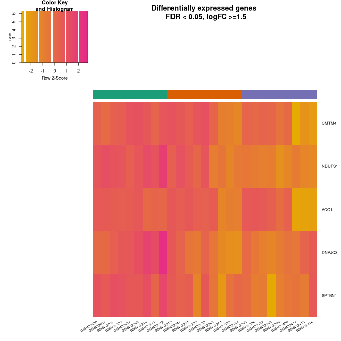
\begin{center}Fig.3: Heatmap of downregulated genes\end{center}
 
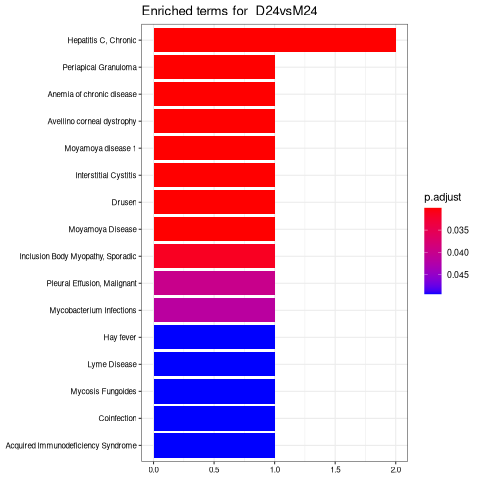
\begin{center}Fig.4: Bar plot of DGN Enriched data for D24vsM24\end{center}
 
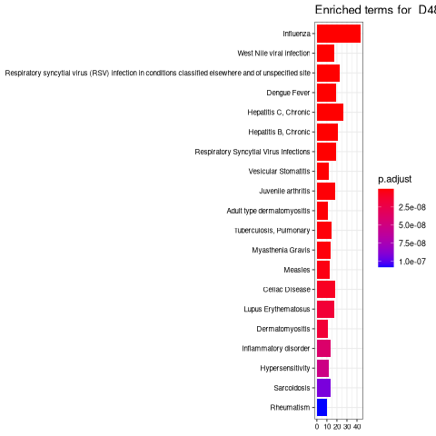
\begin{center}Fig.5: Barplot of DGN Enriched data for D48vsM48\end{center}
 

\begin{center}Fig.6: Barplot of DGN Enriched data for S12vsM12\end{center}
 
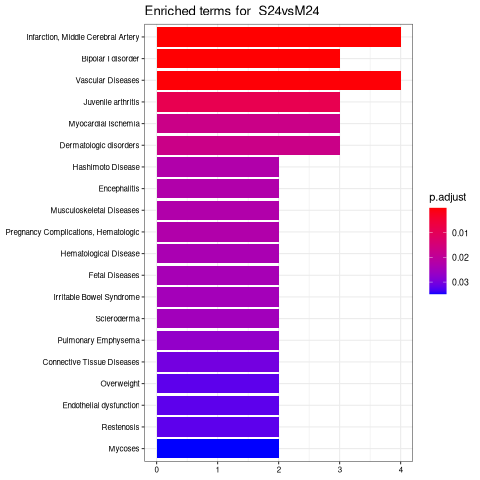
\begin{center}Fig.7: Barplot of DGN Enriched data for S24vsM24\end{center}
 
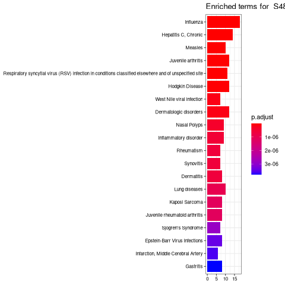
\begin{center}Fig.8: Barplot of DGN Enriched data for S48vsM48\end{center}
 
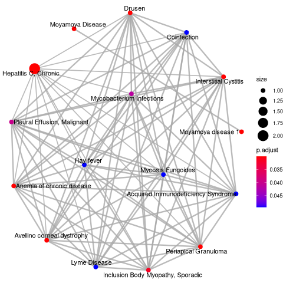
\begin{center}Fig.9: Enriched map for D24vsM24\end{center} 
 
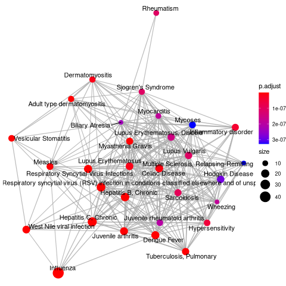
\begin{center}Fig.10: Enriched map for D48vsM48\end{center}
 
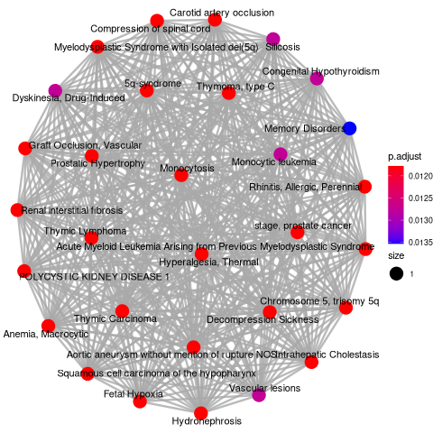
 \begin{center}Fig.11: nriched map for S12vsM12\end{center} 
 
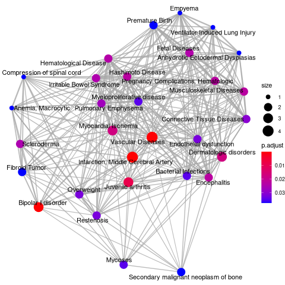
 \begin{center}Fig.12: Enriched map for S24vsM24\end{center}
 
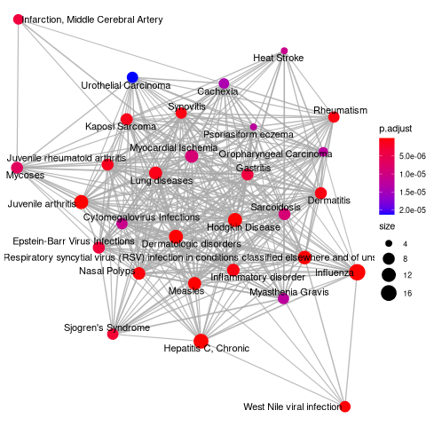
 <center>**Fig.13: Enriched map for S48vsM48\end{center}
 

\begin{center}Fig.14: PCA for raw data\end{center}

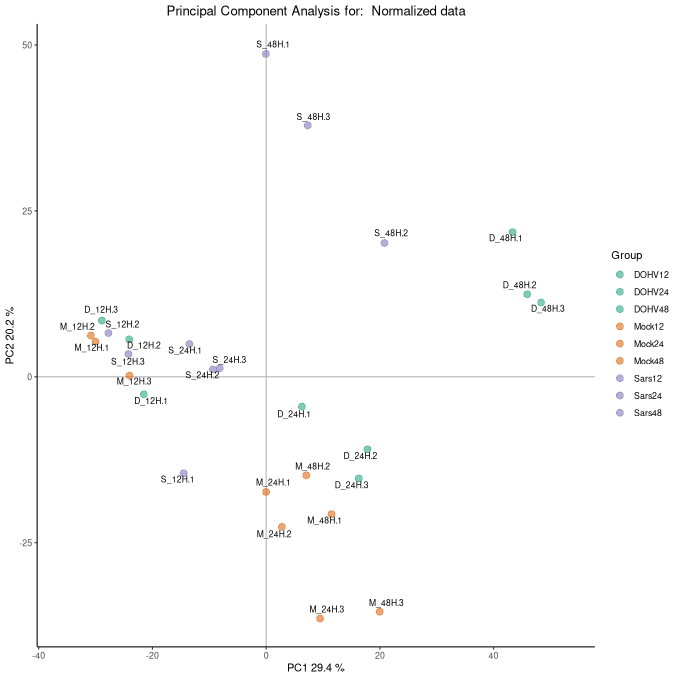
\begin{center}Fig.15: PCA for Normalized data\end{center}

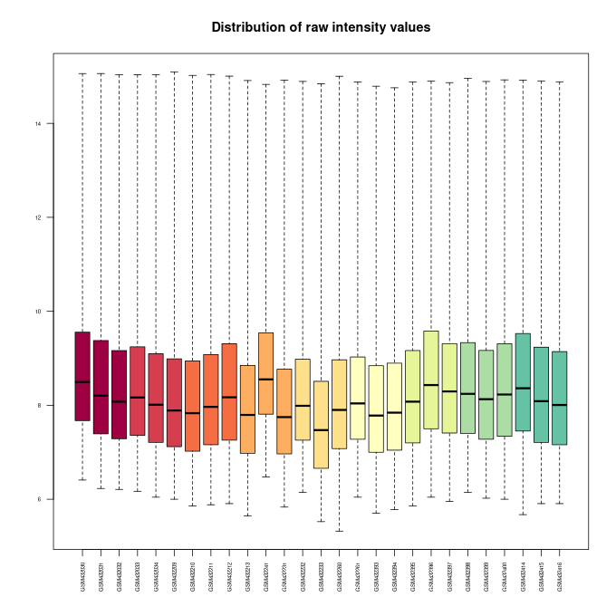
\begin{center}Fig.16: Boxplot for raw data\end{center}
 
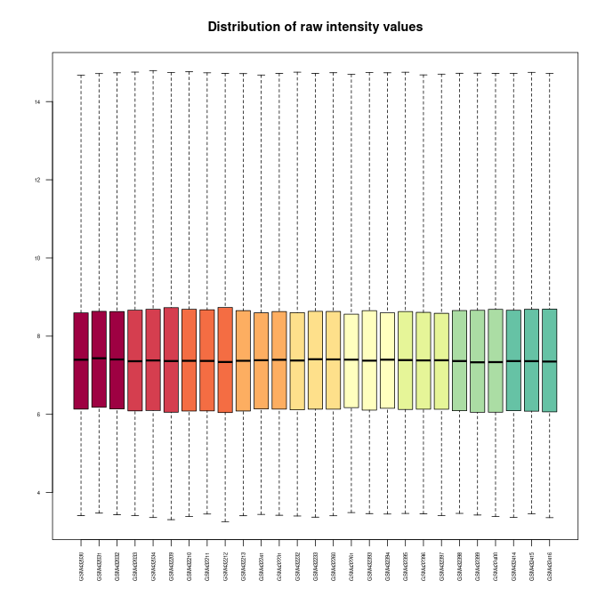

\begin{center}Fig.17: Boxplot for Normalized data\end{center}

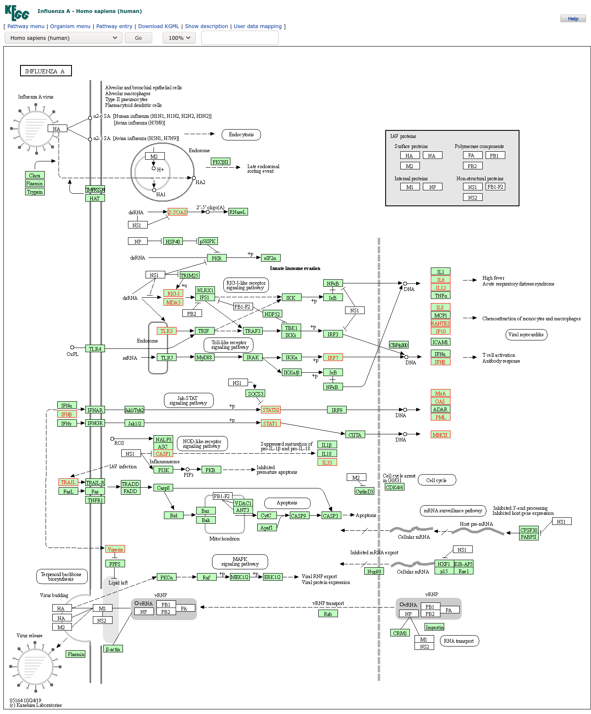
\begin{center}Fig.18: Influenza A pathway\end{center}
# Discusion  

`limma` offers a straightforward approach to gene expression analysis. Another great surprise was the large number of possibilities that the `clusterProfiler` package includes to perform deeper pathway analysis starting from the results of the experiment.


# Apendix

## R packages list
knitr  
https://yihui.org/knitr/  
BiocManager  
https://cran.r-project.org/web/packages/BiocManager/vignettes/BiocManager.html  

Biobase  
https://www.bioconductor.org/packages/release/bioc/html/Biobase.html  

kableExtra  
https://cran.r-project.org/web/packages/kableExtra/vignettes/awesome_table_in_html.html  

oligo  
https://www.bioconductor.org/packages/release/bioc/html/oligo.html  

pvca  
https://www.bioconductor.org/packages/release/bioc/html/pvca.html  

ggrepel  
https://cran.r-project.org/web/packages/ggrepel/vignettes/ggrepel.html  

colorspace  
https://cran.r-project.org/web/packages/colorspace/vignettes/colorspace.html  

gplots  
https://cran.r-project.org/web/packages/ggplot2/index.html  

ggupset  
https://github.com/const-ae/ggupset  

magrittr  
https://cran.r-project.org/web/packages/magrittr/vignettes/magrittr.html  

clusterProfiler  
https://bioconductor.org/packages/release/bioc/html/clusterProfiler.html  

DOSE  
https://www.bioconductor.org/packages/release/bioc/html/DOSE.html  

RColorBrewer  
https://www.rdocumentation.org/packages/RColorBrewer/versions/1.1-2/topics/RColorBrewer  

ggplot2  
https://ggplot2.tidyverse.org/  

hgu133plus2.db  
http://bioconductor.org/packages/release/data/annotation/html/hgu133plus2.db.html  

arrayQualityMetrics  
https://www.bioconductor.org/packages/release/bioc/html/arrayQualityMetrics.html  

limma  
https://www.bioconductor.org/packages/release/bioc/html/limma.html  

genefilter  
https://bioconductor.org/packages/release/bioc/html/genefilter.html  

annotate  
https://www.bioconductor.org/packages/release/bioc/html/annotate.html  

enrichplot  
https://bioconductor.org/packages/release/bioc/html/enrichplot.html  


  
# References  


